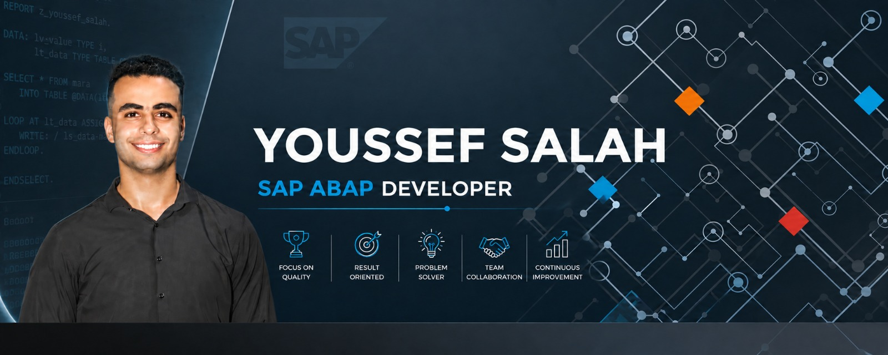

 

# Youssef Salah

### SAP ABAP Developer

 

## 👨‍💻 About Me

I'm **Youssef Salah**, a SAP ABAP Developer focused on building
reliable, efficient, and business-oriented solutions using SAP technologies.

My interests include **ABAP development, SAP S/4HANA, business process
integration, problem solving, debugging, and clean code development**.

I'm continuously improving my technical and functional knowledge with the
goal of creating SAP solutions that are technically strong and valuable
to the business.

---

## ⚡ SAP Development

  

 

---

## 🧩 Functional Knowledge

  

---

## 🛠️ Tools & Technologies

---

## 💼 What I Do

<table>
<tr>

<td align="center" width="50%">

### 

**SAP Development**

Develop custom SAP ABAP applications,
reports, and business solutions with
a focus on clean and maintainable code.

</td>

<td align="center" width="50%">

### 

**Business Processes**

Understand business requirements and
connect technical SAP solutions with
real business processes.

</td>

</tr>

<tr>

<td align="center" width="50%">

### 

**Problem Solving**

Analyze technical problems, debug
applications, and develop efficient
solutions.

</td>

<td align="center" width="50%">

### 

**Continuous Improvement**

Continuously improve my ABAP skills,
SAP knowledge, code quality, and
development practices.

</td>

</tr>
</table>

---

## 🎯 Current Focus

  

---

## 📊 Developer Mindset

---

### "When your work speaks for itself, don't interrupt."

**— Henry J. Kaiser**

 

  

